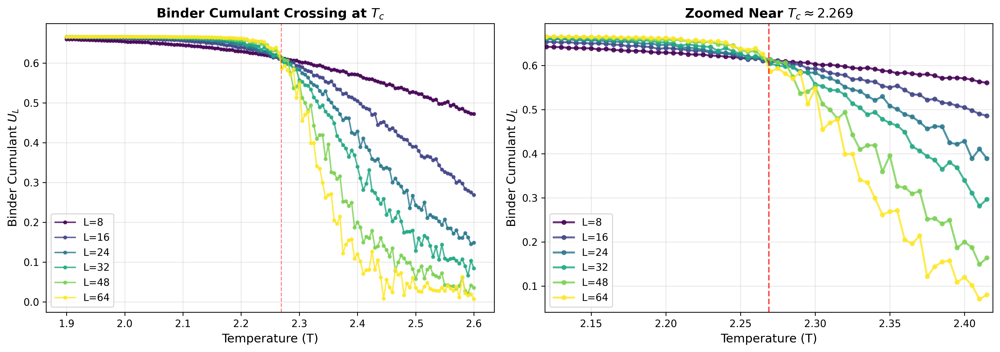
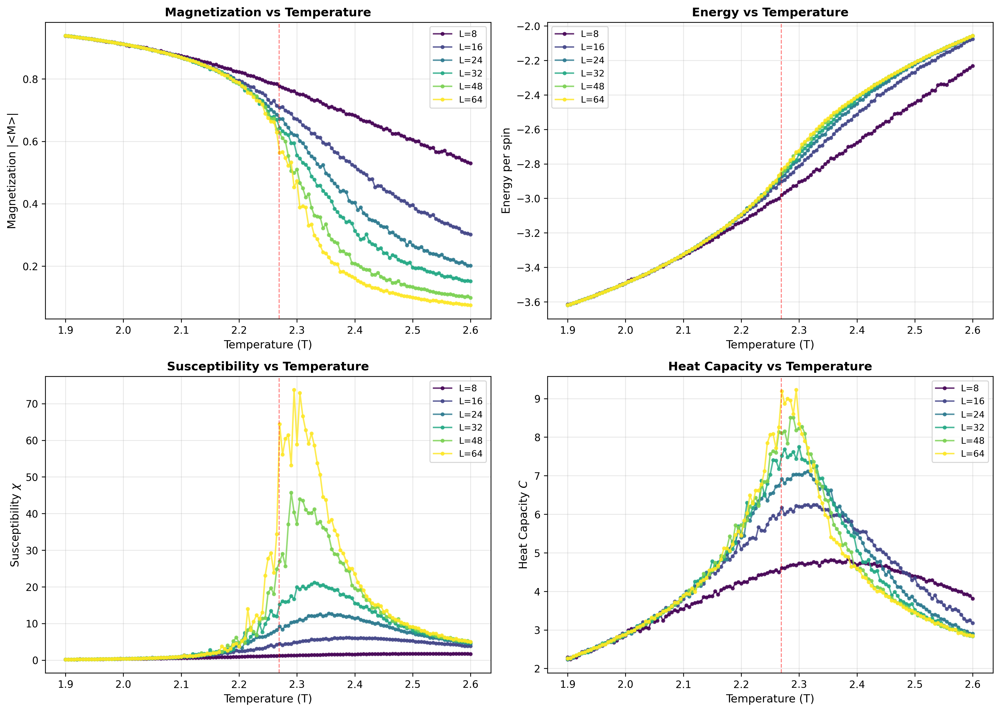
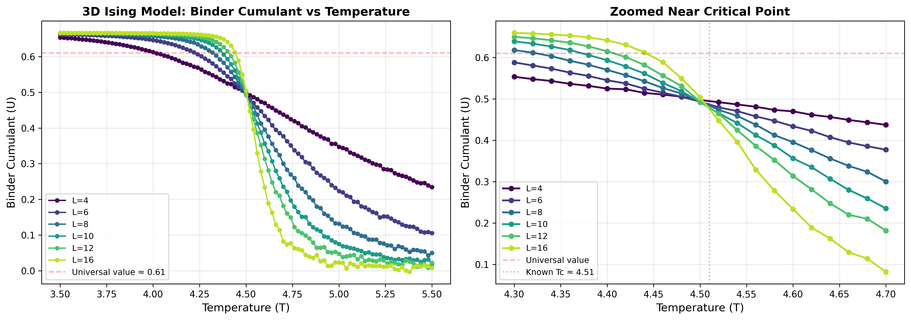
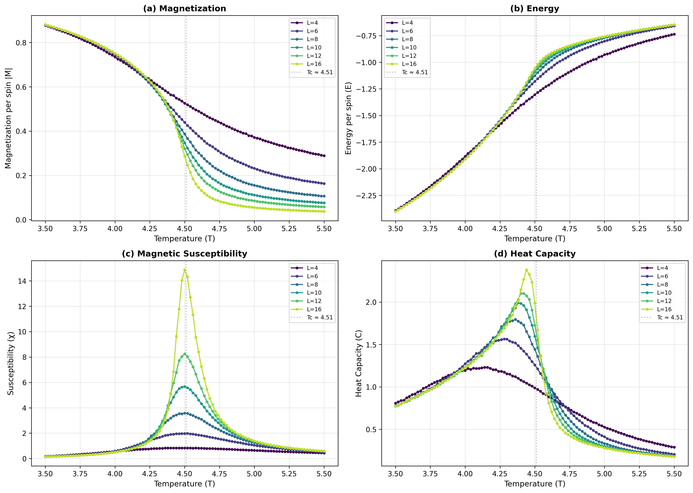

# Ising Model Monte Carlo Simulation

A high-performance C implementation of 1D, 2D, and 3D Ising model simulations using Monte Carlo methods with the Metropolis algorithm.

## Overview

The Ising model is a mathematical model of ferromagnetism in statistical mechanics, used to study phase transitions and critical phenomena. This implementation provides:

- **1D Ising Model** (`ising1d.c`): One-dimensional chain with periodic boundary conditions
- **2D Ising Model** (`ising2d.c`): Two-dimensional square lattice with periodic boundary conditions
- **3D Ising Model** (`ising3d.c`): Three-dimensional cubic lattice with periodic boundary conditions
- **Finite-Size Scaling Analysis**: FSS tools with Binder cumulant for 2D and 3D critical temperature determination
- **Modern PCG Random Number Generator**: Fast, high-quality random numbers for Monte Carlo sampling
- **Comprehensive Test Suite**: Validates random number generation and physics

## Key Features

- 🚀 **High Performance**: Optimized C code with modern PCG random number generator
- 🔬 **Physics Accurate**: Proper Metropolis algorithm implementation
- 📊 **Complete Analysis**: Calculates magnetization, energy, susceptibility, and heat capacity
- ✅ **Well Tested**: Comprehensive test suite for reliability
- 📈 **Temperature Sweeps**: Automatic temperature sweeping from T=3.01 to T=0.01

## Quick Start

### Build
```bash
make all
```

### Run Tests
```bash
make test
```

### Run Simulations
```bash
# 1D Ising model with 100 spins
./ising1d 100

# 2D Ising model with 50×50 lattice
./ising2d 50

# 3D Ising model with 20×20×20 lattice
./ising3d 20
```

## Detailed Usage

### Command Line Interface

All programs take the system size as a command line argument:

```bash
# 1D: N spins
./ising1d N

# 2D: N×N lattice
./ising2d N

# 3D: N×N×N lattice
./ising3d N
```

### Output Format

Both programs output tab-separated values for each temperature point:

```
Temperature  Magnetization  Energy  Susceptibility  Heat_Capacity
3.010000     0.355721      -0.642628    0.227735      0.396727
3.000000     0.356154      -0.644540    0.228632      0.397261
...
```

### Physics Parameters

- **Temperature Range**: T = 3.01 → 0.01 (step = 0.01)
- **Thermalization**: 200,000 Monte Carlo steps
- **Measurement**: 200,000 Monte Carlo steps
- **Units**: Natural units (J = 1, k_B = 1)
- **Boundary Conditions**: Periodic

## Random Number Generator

This implementation uses **PCG (Permuted Congruential Generator)**, replacing the original closed-source Mersenne Twister dependency:

### Why PCG?
- ✅ **Faster** than Mersenne Twister
- ✅ **Better statistical properties**
- ✅ **Open source** and widely adopted
- ✅ **Default in NumPy** (since 2019)
- ✅ **Perfect for Monte Carlo** simulations

### PCG Interface
The `pcg_random.h` header provides these functions:
- `init_rnd(seed)`: Initialize with seed
- `drnd()`: Generate random double in [0,1)
- `gus()`: Generate seed from current time

## Physics Background

### The Ising Model

The Ising model consists of discrete variables (spins) that can be in one of two states (+1 or -1). The Hamiltonian is:

```
H = -J Σ s_i s_j
```

Where the sum is over nearest neighbors, J is the coupling constant (J=1 in our units), and s_i are the spin variables.

### Monte Carlo Method

We use the **Metropolis algorithm**:
1. Choose a random spin
2. Calculate energy change ΔE if flipped
3. Accept flip if:
   - ΔE < 0 (energetically favorable), OR
   - Random number < exp(-ΔE/T) (thermal fluctuation)

### Measured Quantities

- **Magnetization**: M = |⟨Σ s_i⟩| / N
- **Energy**: E = ⟨H⟩ / N
- **Susceptibility**: χ = (⟨M²⟩ - ⟨M⟩²) / T
- **Heat Capacity**: C = (⟨E²⟩ - ⟨E⟩²) / T²

### Critical Temperature

- **1D Ising**: No finite-temperature phase transition (T_c = 0)
- **2D Ising**: Critical temperature T_c ≈ 2.269 (exact: 2/ln(1+√2))
- **3D Ising**: Critical temperature T_c ≈ 4.51 (from high-precision simulations)

## Testing and Validation

### Run Test Suite
```bash
make test
```

The test suite validates:
- PCG random number generator quality and reproducibility
- Physics correctness (high-T → low magnetization, low-T → high magnetization)
- 1D, 2D, and 3D model functionality
- Binder cumulant calculation accuracy

### Quick Tests
```bash
# Quick 1D test
make test-1d

# Quick 2D test
make test-2d

# Performance benchmark
make benchmark
```

## Performance Notes

### Computational Complexity
- **1D**: O(N) per Monte Carlo step
- **2D**: O(N²) per Monte Carlo step
- **3D**: O(N³) per Monte Carlo step
- **Memory**: O(N) for 1D, O(N²) for 2D, O(N³) for 3D

### Recommended System Sizes
- **1D**: N = 100-10000 (fast)
- **2D**: N = 10-100 (N=100 takes ~hours)
- **3D**: N = 10-30 (N=30 takes ~hours)

### Optimization Tips
- Use smaller systems (N < 50) for 2D when testing
- Use even smaller systems (N < 20) for 3D when testing
- For production runs, consider running overnight for large 2D/3D systems
- The code is already optimized with `-O2` compilation

## Finite-Size Scaling and Binder Cumulant Analysis

### Overview

The repository includes **finite-size scaling (FSS)** analysis tools to precisely determine the critical temperature T_c of the 2D and 3D Ising models using the **Binder cumulant crossing method**.

### What is Binder Cumulant?

The Binder cumulant is defined as:

```
U_L = 1 - <M⁴> / (3<M²>²)
```

This dimensionless quantity has a remarkable property: **at the critical temperature T_c, the Binder cumulant becomes independent of system size**. When plotted against temperature for different system sizes L, all curves cross at a single point—the critical temperature.

### Running FSS Analysis

#### 2D FSS Analysis

```bash
# Compile the 2D FSS version
gcc -Wall -Wextra -Wpedantic -o ising2d_fss ising2d_fss.c -lm

# Run simulation (this will take several hours)
./ising2d_fss > fss_data.txt

# Generate plots
python3 plot_binder.py
```

#### 3D FSS Analysis

```bash
# Compile the 3D FSS version
gcc -Wall -Wextra -Wpedantic -o ising3d_fss ising3d_fss.c -lm

# Run simulation (this will take several hours)
./ising3d_fss > fss_data_3d.txt

# Generate plots
python3 plot_binder_3d.py
```

### FSS Parameters

#### 2D FSS Parameters

- **System Sizes**: L = 8, 16, 24, 32, 48, 64
- **Temperature Range**: T = 2.6 → 1.9 (focused near T_c ≈ 2.269)
- **Temperature Resolution**: ΔT = 0.005 (finer than basic simulation)
- **Thermalization**: 200,000 Monte Carlo steps per temperature
- **Measurement**: 200,000 Monte Carlo steps per temperature

#### 3D FSS Parameters

- **System Sizes**: L = 4, 6, 8, 10, 12, 16
- **Temperature Range**: T = 5.5 → 3.5 (focused near T_c ≈ 4.51)
- **Temperature Resolution**: ΔT = 0.02
- **Thermalization**: 200,000 Monte Carlo steps per temperature
- **Measurement**: 200,000 Monte Carlo steps per temperature
- **Note**: Smaller system sizes due to O(N³) scaling

### Output Files

#### 2D FSS Plots

The 2D analysis generates two plots:

1. **binder_crossing.png**: Binder cumulant crossing plot
   - Shows all system sizes crossing at T_c ≈ 2.269
   - Includes zoomed view near the critical point



2. **fss_complete_analysis.png**: Complete finite-size scaling analysis
   - Magnetization vs temperature for all L
   - Energy vs temperature for all L
   - Susceptibility vs temperature for all L
   - Heat capacity vs temperature for all L



#### 3D FSS Plots

The 3D analysis generates two plots:

1. **binder_crossing_3d.png**: Binder cumulant crossing plot for 3D
   - Shows all system sizes crossing at T_c ≈ 4.51
   - Includes zoomed view near the critical point



2. **fss_complete_analysis_3d.png**: Complete 3D finite-size scaling analysis
   - All thermodynamic quantities vs temperature for all L
   - Shows critical exponents: β ≈ 0.326, γ ≈ 1.237, ν ≈ 0.630



### Output Data Format

The FSS simulation outputs tab-separated values:

```
N  Temperature  Magnetization  Energy  Susceptibility  Heat_Capacity  Binder_Cumulant
8  2.600000     0.123456      -0.987654    1.234567       0.876543      0.456789
...
```

### Physical Interpretation

#### 2D Interpretation

- **Crossing Point**: The temperature where all Binder cumulant curves intersect is the critical temperature T_c
- **Finite-Size Effects**: Larger systems show sharper transitions near T_c
- **Critical Value**: The Binder cumulant at T_c approaches U* ≈ 0.610 (universal value for 2D Ising)
- **Exact T_c**: The 2D Ising model has T_c = 2/ln(1+√2) ≈ 2.269185... (Onsager's exact solution)

#### 3D Interpretation

- **Crossing Point**: All Binder cumulant curves intersect at T_c ≈ 4.51
- **Different Universality Class**: 3D Ising belongs to a different universality class than 2D
- **Critical Exponents**: β ≈ 0.326, γ ≈ 1.237, ν ≈ 0.630 (different from 2D values)
- **Real Systems**: 3D Ising model describes real ferromagnetic materials and liquid-gas transitions

### Why This Works

The Binder cumulant method is powerful because:
- ✅ **Size-independent at T_c**: Eliminates finite-size ambiguity
- ✅ **High precision**: Crossing point can be determined to many decimal places
- ✅ **Standard method**: Widely used in computational statistical physics
- ✅ **No fitting required**: Direct visual identification of T_c

## File Structure

```
isingmodel/
├── README.md            # This file
├── CLAUDE.md            # Developer documentation
├── Makefile             # Build system
├── pcg_random.h         # PCG random number generator
├── ising1d.c            # 1D Ising model implementation
├── ising2d.c            # 2D Ising model implementation
├── ising2d_fss.c        # 2D FSS analysis with Binder cumulant
├── ising3d.c            # 3D Ising model implementation
├── ising3d_fss.c        # 3D FSS analysis with Binder cumulant
├── plot_binder.py       # Python plotting script for 2D FSS analysis
├── plot_binder_3d.py    # Python plotting script for 3D FSS analysis
├── test_suite.c         # Comprehensive test suite
└── (executables)        # Generated by make
```

## Build System

The included `Makefile` provides:

```bash
make all        # Build all programs
make test       # Run test suite
make test-1d    # Quick 1D test
make test-2d    # Quick 2D test
make benchmark  # Performance test
make clean      # Remove executables
make help       # Show all options
```

## Example Analysis

### Phase Transition Study

```bash
# Generate data
./ising2d 20 > results_2d.dat

# Plot with your favorite tool (gnuplot, matplotlib, etc.)
# Look for:
# - Magnetization drop near T ≈ 2.27
# - Susceptibility peak at critical temperature
# - Heat capacity peak at critical temperature
```

### Critical Exponents

Near the critical temperature T_c, physical quantities follow power laws:
- Magnetization: M ∝ (T_c - T)^β
- Susceptibility: χ ∝ |T - T_c|^(-γ)
- Heat capacity: C ∝ |T - T_c|^(-α)

For 2D Ising: β = 1/8, γ = 7/4, α = 0 (logarithmic)
For 3D Ising: β ≈ 0.326, γ ≈ 1.237, α ≈ 0.110, ν ≈ 0.630

## References

- [Ising Model - Wikipedia](https://en.wikipedia.org/wiki/Ising_model)
- [Monte Carlo Methods in Statistical Physics](https://en.wikipedia.org/wiki/Monte_Carlo_method_in_statistical_physics)
- [PCG Random Number Generator](https://www.pcg-random.org/)
- Onsager, L. (1944). "Crystal statistics. I. A two-dimensional model with an order-disorder transition"

## License

This code is provided for educational and research purposes.

---

# 이징 모델 몬테카를로 시뮬레이션 (한국어)

메트로폴리스 알고리즘을 사용한 몬테카를로 방법으로 구현된 고성능 C 기반 1D, 2D, 3D 이징 모델 시뮬레이션입니다.

## 개요

이징 모델은 통계역학에서 강자성을 나타내는 수학적 모델로, 상전이와 임계 현상을 연구하는데 사용됩니다. 이 구현은 다음을 제공합니다:

- **1D 이징 모델** (`ising1d.c`): 주기적 경계 조건을 가진 일차원 체인
- **2D 이징 모델** (`ising2d.c`): 주기적 경계 조건을 가진 이차원 정사각 격자
- **3D 이징 모델** (`ising3d.c`): 주기적 경계 조건을 가진 삼차원 큐빅 격자
- **유한 크기 스케일링 분석**: 2D 및 3D 임계 온도 결정을 위한 Binder cumulant를 사용한 FSS 도구
- **현대적 PCG 난수 생성기**: 몬테카를로 샘플링을 위한 빠르고 고품질의 난수
- **포괄적 테스트 스위트**: 난수 생성 및 물리학 검증

## 주요 특징

- 🚀 **고성능**: 현대적 PCG 난수 생성기를 사용한 최적화된 C 코드
- 🔬 **물리학적 정확성**: 올바른 메트로폴리스 알고리즘 구현
- 📊 **완전한 분석**: 자화율, 에너지, 자화 감수율, 열용량 계산
- ✅ **잘 테스트됨**: 신뢰성을 위한 포괄적 테스트 스위트
- 📈 **온도 스위핑**: T=3.01에서 T=0.01까지 자동 온도 스위핑

## 빠른 시작

### 빌드
```bash
make all
```

### 테스트 실행
```bash
make test
```

### 시뮬레이션 실행
```bash
# 100개 스핀을 가진 1D 이징 모델
./ising1d 100

# 50×50 격자를 가진 2D 이징 모델
./ising2d 50

# 20×20×20 격자를 가진 3D 이징 모델
./ising3d 20
```

## 상세 사용법

### 명령줄 인터페이스

모든 프로그램이 시스템 크기를 명령줄 인수로 받습니다:

```bash
# 1D: N개 스핀
./ising1d N

# 2D: N×N 격자
./ising2d N

# 3D: N×N×N 격자
./ising3d N
```

### 출력 형식

두 프로그램 모두 각 온도점에 대해 탭으로 구분된 값을 출력합니다:

```
Temperature  Magnetization  Energy  Susceptibility  Heat_Capacity
3.010000     0.355721      -0.642628    0.227735      0.396727
3.000000     0.356154      -0.644540    0.228632      0.397261
...
```

### 물리 매개변수

- **온도 범위**: T = 3.01 → 0.01 (단계 = 0.01)
- **열평형화**: 200,000 몬테카를로 단계
- **측정**: 200,000 몬테카를로 단계
- **단위**: 자연 단위 (J = 1, k_B = 1)
- **경계 조건**: 주기적

## 난수 생성기

이 구현은 원래의 클로즈드 소스 메르센 트위스터 의존성을 대체하여 **PCG (순열 합동 생성기)**를 사용합니다:

### 왜 PCG인가?
- ✅ 메르센 트위스터보다 **빠름**
- ✅ **더 나은 통계적 특성**
- ✅ **오픈 소스**이며 널리 채택됨
- ✅ **NumPy의 기본값** (2019년부터)
- ✅ 몬테카를로 시뮬레이션에 **완벽함**

### PCG 인터페이스
`pcg_random.h` 헤더는 다음 함수들을 제공합니다:
- `init_rnd(seed)`: 시드로 초기화
- `drnd()`: [0,1) 범위의 랜덤 double 생성
- `gus()`: 현재 시간에서 시드 생성

## 물리학적 배경

### 이징 모델

이징 모델은 두 상태(+1 또는 -1) 중 하나가 될 수 있는 이산 변수(스핀)들로 구성됩니다. 해밀토니안은:

```
H = -J Σ s_i s_j
```

여기서 합은 최근접 이웃에 대한 것이고, J는 결합 상수(우리 단위에서 J=1), s_i는 스핀 변수입니다.

### 몬테카를로 방법

**메트로폴리스 알고리즘**을 사용합니다:
1. 랜덤한 스핀 선택
2. 뒤집혔을 때의 에너지 변화 ΔE 계산
3. 다음 조건에서 뒤집기 허용:
   - ΔE < 0 (에너지적으로 유리), 또는
   - 랜덤 수 < exp(-ΔE/T) (열적 요동)

### 측정 물리량

- **자화율**: M = |⟨Σ s_i⟩| / N
- **에너지**: E = ⟨H⟩ / N
- **자화 감수율**: χ = (⟨M²⟩ - ⟨M⟩²) / T
- **열용량**: C = (⟨E²⟩ - ⟨E⟩²) / T²

### 임계 온도

- **1D 이징**: 유한 온도 상전이 없음 (T_c = 0)
- **2D 이징**: 임계 온도 T_c ≈ 2.269 (정확값: 2/ln(1+√2))
- **3D 이징**: 임계 온도 T_c ≈ 4.51 (고정밀도 시뮬레이션 결과)

## 테스트 및 검증

### 테스트 스위트 실행
```bash
make test
```

테스트 스위트는 다음을 검증합니다:
- PCG 난수 생성기 품질 및 재현성
- 물리학적 정확성 (고온 → 낮은 자화율, 저온 → 높은 자화율)
- 1D, 2D, 3D 모델 기능
- Binder cumulant 계산 정확성

### 빠른 테스트
```bash
# 빠른 1D 테스트
make test-1d

# 빠른 2D 테스트
make test-2d

# 성능 벤치마크
make benchmark
```

## 성능 참고사항

### 계산 복잡도
- **1D**: 몬테카를로 단계당 O(N)
- **2D**: 몬테카를로 단계당 O(N²)
- **3D**: 몬테카를로 단계당 O(N³)
- **메모리**: 1D는 O(N), 2D는 O(N²), 3D는 O(N³)

### 권장 시스템 크기
- **1D**: N = 100-10000 (빠름)
- **2D**: N = 10-100 (N=100은 수 시간 소요)
- **3D**: N = 10-30 (N=30은 수 시간 소요)

### 최적화 팁
- 테스트 시 2D는 작은 시스템(N < 50) 사용
- 테스트 시 3D는 더 작은 시스템(N < 20) 사용
- 실제 연구용으로는 큰 2D/3D 시스템을 밤새 실행 고려
- 코드는 이미 `-O2` 컴파일 최적화됨

## 유한 크기 스케일링 및 Binder Cumulant 분석

### 개요

이 저장소는 **Binder cumulant 교차점 방법**을 사용하여 2D 및 3D 이징 모델의 임계 온도 T_c를 정밀하게 결정하는 **유한 크기 스케일링(FSS)** 분석 도구를 포함합니다.

### Binder Cumulant란?

Binder cumulant는 다음과 같이 정의됩니다:

```
U_L = 1 - <M⁴> / (3<M²>²)
```

이 무차원 양은 놀라운 특성을 가지고 있습니다: **임계 온도 T_c에서 Binder cumulant는 시스템 크기와 무관해집니다**. 서로 다른 시스템 크기 L에 대해 온도의 함수로 그려지면, 모든 곡선이 한 점—임계 온도—에서 교차합니다.

### FSS 분석 실행

#### 2D FSS 분석

```bash
# 2D FSS 버전 컴파일
gcc -Wall -Wextra -Wpedantic -o ising2d_fss ising2d_fss.c -lm

# 시뮬레이션 실행 (수 시간 소요)
./ising2d_fss > fss_data.txt

# 플롯 생성
python3 plot_binder.py
```

#### 3D FSS 분석

```bash
# 3D FSS 버전 컴파일
gcc -Wall -Wextra -Wpedantic -o ising3d_fss ising3d_fss.c -lm

# 시뮬레이션 실행 (수 시간 소요)
./ising3d_fss > fss_data_3d.txt

# 플롯 생성
python3 plot_binder_3d.py
```

### FSS 매개변수

#### 2D FSS 매개변수

- **시스템 크기**: L = 8, 16, 24, 32, 48, 64
- **온도 범위**: T = 2.6 → 1.9 (T_c ≈ 2.269 근처에 집중)
- **온도 해상도**: ΔT = 0.005 (기본 시뮬레이션보다 세밀함)
- **열평형화**: 온도당 200,000 몬테카를로 단계
- **측정**: 온도당 200,000 몬테카를로 단계

#### 3D FSS 매개변수

- **시스템 크기**: L = 4, 6, 8, 10, 12, 16
- **온도 범위**: T = 5.5 → 3.5 (T_c ≈ 4.51 근처에 집중)
- **온도 해상도**: ΔT = 0.02
- **열평형화**: 온도당 200,000 몬테카를로 단계
- **측정**: 온도당 200,000 몬테카를로 단계
- **참고**: O(N³) 스케일링으로 인한 작은 시스템 크기

### 출력 파일

#### 2D FSS 플롯

2D 분석은 두 개의 플롯을 생성합니다:

1. **binder_crossing.png**: Binder cumulant 교차점 플롯
   - T_c ≈ 2.269에서 모든 시스템 크기가 교차하는 것을 보여줌
   - 임계점 근처 확대 뷰 포함


2. **fss_complete_analysis.png**: 완전한 유한 크기 스케일링 분석
   - 모든 L에 대한 자화율 vs 온도
   - 모든 L에 대한 에너지 vs 온도
   - 모든 L에 대한 자화 감수율 vs 온도
   - 모든 L에 대한 열용량 vs 온도


#### 3D FSS 플롯

3D 분석은 두 개의 플롯을 생성합니다:

1. **binder_crossing_3d.png**: 3D Binder cumulant 교차점 플롯
   - T_c ≈ 4.51에서 모든 시스템 크기가 교차하는 것을 보여줌
   - 임계점 근처 확대 뷰 포함


2. **fss_complete_analysis_3d.png**: 완전한 3D 유한 크기 스케일링 분석
   - 모든 L에 대한 모든 열역학적 양 vs 온도
   - 임계 지수를 보여줌: β ≈ 0.326, γ ≈ 1.237, ν ≈ 0.630


### 출력 데이터 형식

FSS 시뮬레이션은 탭으로 구분된 값을 출력합니다:

```
N  Temperature  Magnetization  Energy  Susceptibility  Heat_Capacity  Binder_Cumulant
8  2.600000     0.123456      -0.987654    1.234567       0.876543      0.456789
...
```

### 물리적 해석

#### 2D 해석

- **교차점**: 모든 Binder cumulant 곡선이 교차하는 온도가 임계 온도 T_c입니다
- **유한 크기 효과**: 더 큰 시스템은 T_c 근처에서 더 날카로운 전이를 보입니다
- **임계값**: T_c에서 Binder cumulant는 U* ≈ 0.610에 접근합니다 (2D 이징의 보편적 값)
- **정확한 T_c**: 2D 이징 모델은 T_c = 2/ln(1+√2) ≈ 2.269185... (Onsager의 정확해)

#### 3D 해석

- **교차점**: 모든 Binder cumulant 곡선이 T_c ≈ 4.51에서 교차합니다
- **다른 보편성 클래스**: 3D 이징은 2D와 다른 보편성 클래스에 속합니다
- **임계 지수**: β ≈ 0.326, γ ≈ 1.237, ν ≈ 0.630 (2D 값과 다름)
- **실제 시스템**: 3D 이징 모델은 실제 강자성 물질과 액체-기체 전이를 설명합니다

### 왜 이 방법이 작동하는가

Binder cumulant 방법이 강력한 이유:
- ✅ **T_c에서 크기 독립**: 유한 크기 모호성 제거
- ✅ **고정밀도**: 교차점을 소수점 여러 자리까지 결정 가능
- ✅ **표준 방법**: 계산 통계물리학에서 널리 사용됨
- ✅ **피팅 불필요**: T_c의 직접적인 시각적 식별

## 파일 구조

```
isingmodel/
├── README.md            # 이 파일
├── CLAUDE.md            # 개발자 문서
├── Makefile             # 빌드 시스템
├── pcg_random.h         # PCG 난수 생성기
├── ising1d.c            # 1D 이징 모델 구현
├── ising2d.c            # 2D 이징 모델 구현
├── ising2d_fss.c        # Binder cumulant를 사용한 2D FSS 분석
├── ising3d.c            # 3D 이징 모델 구현
├── ising3d_fss.c        # Binder cumulant를 사용한 3D FSS 분석
├── plot_binder.py       # 2D FSS 분석을 위한 Python 플로팅 스크립트
├── plot_binder_3d.py    # 3D FSS 분석을 위한 Python 플로팅 스크립트
├── test_suite.c         # 포괄적 테스트 스위트
└── (실행파일들)         # make로 생성됨
```

## 빌드 시스템

포함된 `Makefile`은 다음을 제공합니다:

```bash
make all        # 모든 프로그램 빌드
make test       # 테스트 스위트 실행
make test-1d    # 빠른 1D 테스트
make test-2d    # 빠른 2D 테스트
make benchmark  # 성능 테스트
make clean      # 실행파일 제거
make help       # 모든 옵션 표시
```

## 분석 예제

### 상전이 연구

```bash
# 데이터 생성
./ising2d 20 > results_2d.dat

# 좋아하는 도구로 플롯 (gnuplot, matplotlib 등)
# 다음을 찾아보세요:
# - T ≈ 2.27 근처에서 자화율 감소
# - 임계 온도에서 자화 감수율 피크
# - 임계 온도에서 열용량 피크
```

### 임계 지수

임계 온도 T_c 근처에서 물리량들은 멱법칙을 따릅니다:
- 자화율: M ∝ (T_c - T)^β
- 자화 감수율: χ ∝ |T - T_c|^(-γ)
- 열용량: C ∝ |T - T_c|^(-α)

2D 이징의 경우: β = 1/8, γ = 7/4, α = 0 (로그적)
3D 이징의 경우: β ≈ 0.326, γ ≈ 1.237, α ≈ 0.110, ν ≈ 0.630

## 참고문헌

- [이징 모델 - 위키백과](https://ko.wikipedia.org/wiki/%EC%9D%B4%EC%A7%95_%EB%AA%A8%ED%98%95)
- [통계물리학의 몬테카를로 방법](https://en.wikipedia.org/wiki/Monte_Carlo_method_in_statistical_physics)
- [PCG 난수 생성기](https://www.pcg-random.org/)
- Onsager, L. (1944). "Crystal statistics. I. A two-dimensional model with an order-disorder transition"

## 라이선스

이 코드는 교육 및 연구 목적으로 제공됩니다. 
